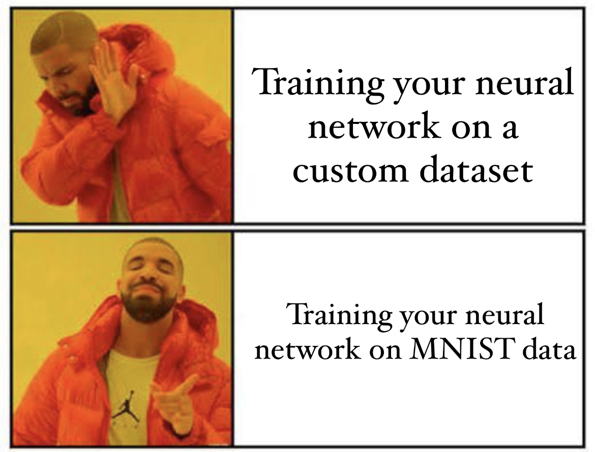
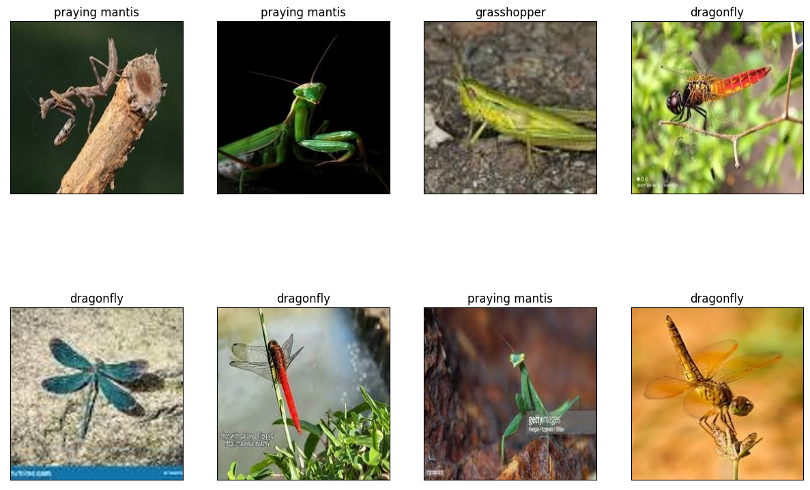
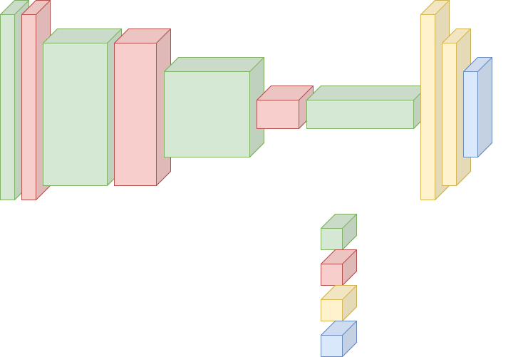

## Training a Custom Convolution Neural Network
Most of the available tutorials on training a CNN use the MNIST data as input to the model. While using MNIST data as a beginner can be easy, working with custom datasets can be a bit of a problem.

In this blog post we will be discussing:
- Creating a custom dataset to train a neural network on
- Creating a custom Convolution Neural Network
- Training the custom network on our dataset
- Evaluating the network on a test set


### Downloading images for custom classifier

Before we start, we shall discuss how to collect images for your custom dataset. For this, we use [Image Downloader](https://chrome.google.com/webstore/detail/image-downloader/cnpniohnfphhjihaiiggeabnkjhpaldj) a chrome extension that allows you to download all the images in a given webpage. We could have used a python tool as well, but the extension allows us to manually deselect images we do not require, this means we will not need to check the downloaded images later and manually remove unwanted images at a later stage. Once we have installed the extension, we can start downloading multiple images using the extension easily. For the sake of our tutorial, we shall be creating a classifier that can classify grasshoppers, praying mantes and dragonflies. We start with downloading images for grasshoppers.

This [video](https://vimeo.com/756742272) shows in detail how we can download multiple images using the Image Downloader extension. We first scroll down until the page limit is exhausted, this makes sure that we get enough images. We can then open the extension and then manually check the images and unselect the irrelevant images like cartoons, drawings, and images belonging to other insects or animals. Once that is done, we can mention that we need the images in a separate sub-folder and start the download. This will create a sub-folder by name of "grasshoppers" in your default download location and you can find the images in the folder.

We can then transfer the downloaded folder into our working directory. The working directory structure for this experiment can be found in the GitHub repository [here](https://github.com/sheikhazhanmohammed/codebase-cv-blog/tree/main/customClassifierTraining). Once we have the images for all the classes downloaded, we can start to arrange our data. Before doing that, we would need to rename our files, most of the images we had downloaded earlier can have different extensions and irregular names. We need to write a script that reads these images and rewrites the image as a "jpg" image with a regular naming scheme. This can be done with the script given below:

```python
import os
import cv2
from tqdm import tqdm

i = 0
for fileName in tqdm(os.listdir("./data/grasshoppers")):
    fileName = os.path.join("./data/grasshoppers",fileName)
    try:
        image = cv2.imread(fileName)
        imageNewName = "image"+str(i)+".jpg"
        imageNewName = os.path.join("./data/grasshoppers",imageNewName)
        cv2.imwrite(imageNewName, image)
        os.remove(fileName)
        i = i + 1
    except:
        os.remove(fileName)
```

In the above script, we first iterate over the files in the folder, then the try block checks if the image can be loaded, written as a jpg file, and then deletes the image, in case any of the steps in the try block fails, we just remove the image in the except block. This gives us all the images in any folder with any extension as a jpg file in a properly named fashion. We do this for all the 3 classes we have.

Once this is done, we can start with our dataset class.

### Defining the dataset class and creating dataloader

Now that our images are all set, we can start with creating a dataset class that will feed the image and labels to our dataloader. We first need a list of paths to images and labels for the images. This can be easily done using:
```python
images = []
labels = []
for folder in os.listdir("./data"):
    if folder=="dragonfly":
        for filename in os.listdir(os.path.join("./data", folder)):
            images.append(os.path.join("./data", folder, filename))
            labels.append("dragonfly")
    if folder=="grasshoppers":
        for filename in os.listdir(os.path.join("./data", folder)):
            images.append(os.path.join("./data", folder, filename))
            labels.append("grasshoppers")
    if folder=="prayingMantes":
        for filename in os.listdir(os.path.join("./data", folder)):
            images.append(os.path.join("./data", folder, filename))
            labels.append("prayingMantes")
```
This generates two lists, one that contains paths to the images and another that contains the respective label for the images. We then create a pandas data frame out of the lists and then shuffle them. Next, we use a label encoder to turn the text label into numerical values, these numerical values will be used as labels for training the neural network. Next, we split the dataset in a 9:1 ratio, where we separate 90% of the data to train the model, and the rest 10% will be used to validate the model. This can be done using:
```python
data = {'ImagePath':images, 'Labels':labels} 
data = pd.DataFrame(data)
data = data.sample(frac=1).reset_index(drop=True)
lb = LabelEncoder()
data['EncodedLabels'] = lb.fit_transform(data['Labels'])

dataTrain = data[0:int(0.9*len(data))]
dataTrain = dataTrain.sample(frac=1).reset_index(drop=True)
dataTest = data[int(0.9*len(data)):]
dataTest = dataTest.sample(frac=1).reset_index(drop=True)
print("Size of training set:",len(dataTrain))
print("Size of testing set:",len(dataTest))
```
Now that we have everything in place, we can start with defining the dataset class. The dataset class is shown below:
```python
class InsectDataset(Dataset):
    def __init__(self, pathToImages, labels, transform=None):
        self.pathToImages = pathToImages
        self.transform = transform
        self.labels = labels
        
    def __len__(self):
        return len(self.pathToImages)
    
    def __getitem__(self, index):
        image = Image.open(self.pathToImages[index])
        #converts images to rgb
        image = image.convert('RGB')
        #resizing image to 256x256
        image = image.resize((256,256))
        label = torch.tensor(self.labels[index])
        if self.transform is not None:
            image = self.transform(image)
        return image, label
```
Once the dataset class is declared, we can create the dataset and the dataloader. This can be done using the code snippet below:
```python
transform = transforms.Compose(
    [transforms.ToTensor(),
     transforms.Normalize((0.5, 0.5, 0.5), (0.5, 0.5, 0.5))])

datasetTrain = InsectDataset(dataTrain['ImagePath'], dataTrain['EncodedLabels'], transform)
datasetTest = InsectDataset(dataTest['ImagePath'], dataTest['EncodedLabels'], transform)

trainLoader = torch.utils.data.DataLoader(datasetTrain, batch_size=8)
testLoader = torch.utils.data.DataLoader(datasetTest, batch_size=4)
```
We can check our trainLoader and display the images and labels with a simple function, this will help us verify if our loader is working correctly.
```python
def displayImage(image):
    image = image / 2 + 0.5
    image = image.numpy()
    image = np.transpose(image, (1, 2, 0))
    return image

dataiter = iter(trainLoader)
images, labels = dataiter.next()
insectType = {0: 'dragonfly', 1: 'grasshopper', 2: 'praying mantis'}
# Viewing data examples used for training
fig, axis = plt.subplots(2, 4, figsize=(15, 10))
for i, ax in enumerate(axis.flat):
    with torch.no_grad():
        image, label = images[i], labels[i]
        ax.imshow(displayImage(image)) # add image
        ax.set(title = f"{insectType[label.item()]}")
        ax.set_xticks([])
        ax.set_yticks([])
```
The output image should look like this:

Now that our dataset is complete, we can start with defining our custom neural network. The next session covers the neural network definition.

### The Neural Network

We shall be using a very simple convolutional neural network for the task. The neural network is composed of various layers, they are mentioned below:
- Convolution layer
- Batch Normalization layer
- Activation layer
- MaxPooling layer
The architecture is depicted in the image below:

The neural network can be defined using the code snippet below:
```python
class Net(nn.Module):
    def __init__(self):
        super(Net, self).__init__()
        self.conv1 = nn.Sequential(nn.Conv2d(3, 32, kernel_size=3),
                                    nn.BatchNorm2d(32),
                                    nn.ReLU(),
                                    nn.MaxPool2d((2,2)))
        self.conv2 = nn.Sequential(nn.Conv2d(32, 64, kernel_size=3),
                                    nn.BatchNorm2d(64),
                                    nn.ReLU(),
                                    nn.MaxPool2d((2,2)))
        self.conv3 = nn.Sequential(nn.Conv2d(64, 128, kernel_size=3),
                                    nn.BatchNorm2d(128),
                                    nn.ReLU(),
                                    nn.MaxPool2d((2,2)))
        self.conv4 = nn.Sequential(nn.Conv2d(128, 256, kernel_size=3),
                                    nn.BatchNorm2d(256),
                                    nn.ReLU(),
                                    nn.Flatten())
        self.fc1 = nn.Linear(200704, 512)
        self.fc2 = nn.Linear(512, 256)
        self.classification = nn.Linear(256, 3)
        
    def forward(self, x):
        x = self.conv1(x)
        x = self.conv2(x)
        x = self.conv3(x)
        x = self.conv4(x)
        x = self.fc1(x)
        x = self.fc2(x)
        x = self.classification(x)
        x = F.log_softmax(x,dim = 1)
        return x
```
Once this is done, we declare the model and transfer it to our device. This is done using:
```python
model = Net()
model.to(device)
```
Next, we begin our training loop and evaluation function, which trains the model using our custom dataset and evaluates it on the test set. The next section covers the training loop and evaluation function.

### Training loop and Evaluation function

We first define our evaluation function, shown in the snippet below:
```python
def evaluateModel(model):
    totalT=0
    correctT=0
    model.eval()
    with torch.no_grad():
        for dataT, targetT in (testLoader):
            dataT, targetT = dataT.to(device), targetT.to(device)
            outputT = model(dataT)
            _, predictionT = torch.max(outputT, dim=1)
            correctT += torch.sum(predictionT==targetT).item()
            totalT += targetT.size(0)
        valiationAccuracy = 100 * (correctT / totalT)
    return valiationAccuracy
```
Next, we declare the loss function and optimizer for training the model:
```python
criterion = nn.CrossEntropyLoss()
optimizer = optim.Adam(model.parameters(), lr=0.0001)
```
Once that is done, we can start with the training loop:
```python
numberOfEpochs = 10
summaryInterval = 100
validationAccuracyMax = 0.0
totalSteps = len(trainLoader)
for epoch in range(1, numberOfEpochs+1):
    print(f'Epoch {epoch}')
    for batch_idx, (data, target) in enumerate(trainLoader):
        data, target = data.to(device), target.to(device)
        optimizer.zero_grad()
        outputs = model(data)
        loss = criterion(outputs, target)
        loss.backward()
        optimizer.step()
        if(batch_idx)%summaryInterval==0:
            print('Epoch [{}/{}], Step [{}/{}], Loss: {:.4f}' .format(epoch, numberOfEpochs, batch_idx, totalSteps, loss.item()))
    validationAccuracy = evaluateModel(model)
    print("Completed training for first epoch")
    print("Accuracy on validation set:", validationAccuracy)
    if validationAccuracyMax<=validationAccuracy:
        validationAccuracyMax = validationAccuracy
        torch.save(model.state_dict(), 'classificationModel.pt')
        print('Detected network improvement, saving current model')
    model.train()
```
This loop shall start training the model and save the model which achieves the best validation results. 

### Conclusion
In this blog post, we learn about how to train a custom neural network on a custom dataset. Remember that the code snippets here are bits and pieces of the actual training code, and the complete training folder can be found [here](https://github.com/sheikhazhanmohammed/codebase-cv-blog/tree/main/customClassifierTraining). 