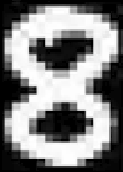
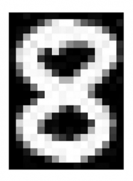
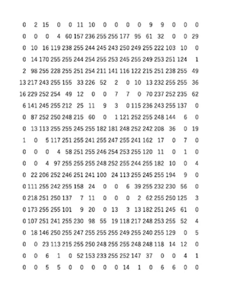
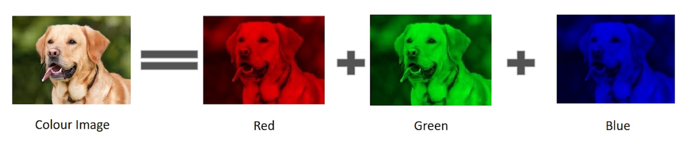
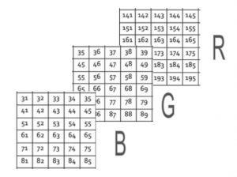
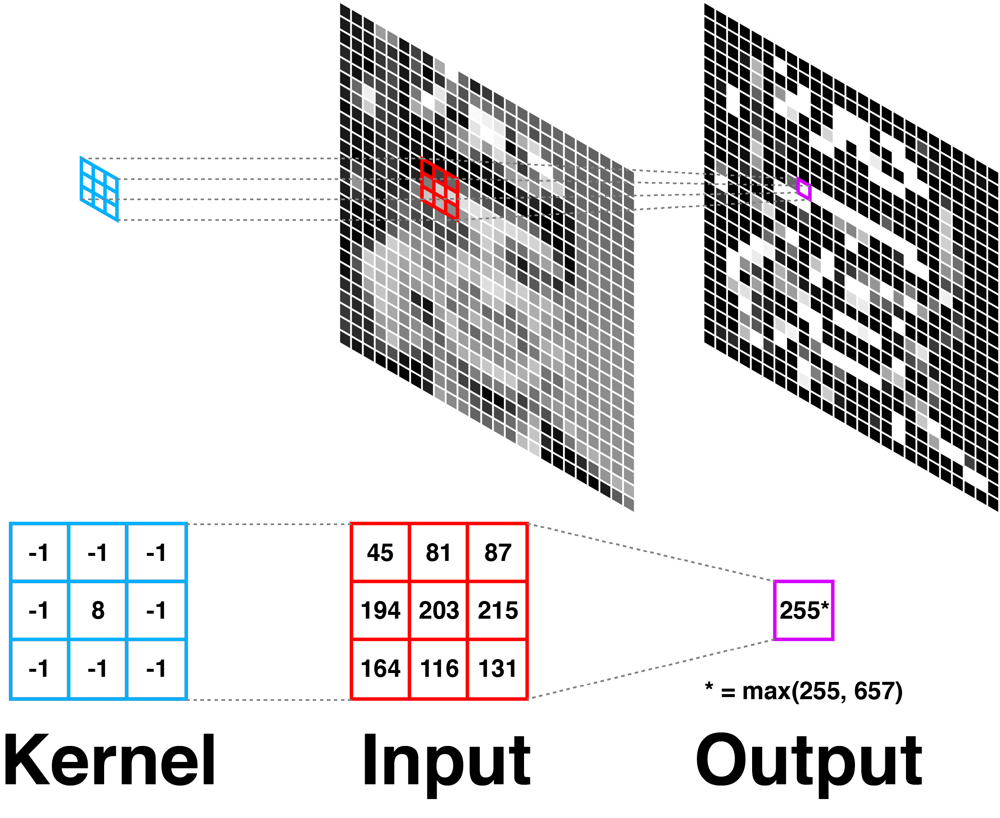

## How Computer Vision Works

### Basic working of a Computer Vision system
A simple computer vision needs lots of data. The data is analysed iteratively over and over until the system learns to distinguish between the images on the basis of certain extracted features. To understand the working of a simple computer vision system, we first need to understand how a human brain comprehends an image. So the question arises how does a human brain comprehend an image? A certain hypotheis states that the human brain relies on patterns to recognize and decode objects. And since we want a computer system to mimic the human understanding of an image, the current state-of-the-art computer vision systems run on pattern recognition.

The systems are fed with a large amount of data and their respective labels to work with, the system updaates itself continuously to find out releavent patterns in the images which can be used to distinguish the iamges on the basis of provided labels. A simple example can be a classification system which distinguishes between different breeds of dogs, each breed of dog has different sets of features, for examples dalmatians have black spots over their body with short fur, labradors have long furs, and similarly other breeds have other distinguishable features, the system will try to learn these distinguishable features from the images to be able to classify them accurately. To get a better idea of how pattern recognition works in images, we will first take a look at how image data is stored in a system, following which we will dive into the details of the how the system works.

### Digital Image
To begin with the understanding of computer vision, an important part is to understand how digital images are stored and comprehended by the system. We will first take a look at grayscale images and then move forward to RGB images.

Let us look at the image of the numeric digit 8 shown below. 

As we zoom into the image, we find the image getting distorder, until a point where we begin to see individual boxes with a shade of color between black and white. At this point, the image starts looking something like the image shown below.

These small individual boxes are referred as pixels. The number of pixels in each direction in the image refer to its resolution. For example a image having size 1080x720 would mean that the image has 1080 pixels in the horizontal direction and 720 pixels in the vertical direction. Each of these pixels contain an integer value, which depicts the intensity, for a grayscale or RGB image the value stored in these pixels vary between 0 to 255. The number closer to 0 represents a darker shade, while closer to 255 represents a lighter shade. So every image stored in a computer is stored in form of a matrix, where each element in the matrix represents the value at the mentioned pixel. Each of these matrices is also known as a channel. A grayscale image has single channel, while a RGB image has 3 channels, where each channel stores values of intensities for the particular color. The matrix for the grayscale 8 image would look something like the matrix shown below.

Now let us look at how colored, or more specifically RGB images are stored in a computer system. As discussed earlier, each colored image is composed of different channels, namely Red, Green and Blue. Decomping an image into these shades might give a result as the images shown below.

So in this case, the image will have 3 different channels, each having intensities for the respective color spectrum. The collection of these matrices would look something like the matrix shown below, where each pixel will have a value ranging from 0 to 255, representing the intensity of respective color with regards to the pixel.

Now that we have an idea of how images are stored in a system, let us move forward with how the system uses these matrices to draw similarities between patterns and understand what an image contains.

### Patterns in a Digtal Image
As discussed earlier images are composed of matrices with pixel values which contain color information stored in an image. Traditional neural networks were composed of stacked fully connected layers or linear layers, but a fully connected layer would only focus at one pixel at a time and it leads to problems as a single pixel cannot explain a pattern present in the image. This is why modern computer vision systems are enabled with learning mechanisms which focus on a region or a patch in the image. These patches can help the system to extract valuable information about shape and size of an object in the image and help it in recognizing recurrent patters. For these operations we have kernels, which are in a way similar to a feed forward network, only that they extract information patchwise by taking into account a collection of pixels rather than a single pixel.

A lot of research has been done to come up with some predefined kernels, but a neural network can also have custom kernels which can help in extracting information related to the given task. A collection of learnable kernels makes up the basic building block of a computer vision system, otherwise known as Convolution block. A convolution neural network has various layers of convolution blocks, each having a different kernel which extracts some useful information from the image and helps in recognition of existing patterns in images. Each subsequent convolution layers forms a different image which is composed of the information it derived from the previous layer, building up complex features as we go deeper in the network. The next section discusses more about kernels, and how they work.

### Kernels and how they work
As explained earlier, kernels are matrices used to extract features or information from an image, but the question is how does a kernel extract information. A kernel matrix is slid across an image, and each element of the kernel matrix is multiplied with the element of image matrix, the results of these multiplications, are either average or maxium value is taken and then stored as a new image, which contains the extracted information. The image shown below shows how a kernel interacts with an input image to extract features.

Kernel multiplication can be used to extract edges or other superficial features from an image. We will discuss about such kernels in further blogs. A collection of kernels can be bunched together to extract various features from the same image, this process of stacking together kernels is used in convolutional neural networks to extract features from an image.

### Conclusion
We start with a simple understanding of a digital image, how it is stored and comprehended in a system. We then understand about pattern in an image, and how they lead to decision making in computer vision systems, and how a computer vision system uses kernels to extract information out of an image. In the coming blog, we will discuss more about kernels, and some pre-defined kernels, and how they are used to extract specific information from an image.