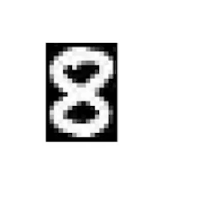

## How Computer Vision Works

### Basic working of a Computer Vision system
A simple computer vision needs lots of data. The data is analysed iteratively over and over until the system learns to distinguish between the images on the basis of certain extracted features. To understand the working of a simple computer vision system, we first need to understand how a human brain comprehends an image. So the question arises how does a human brain comprehend an image? A certain hypotheis states that the human brain relies on patterns to recognize and decode objects. And since we want a computer system to mimic the human understanding of an image, the current state-of-the-art computer vision systems run on pattern recognition.

The systems are fed with a large amount of data and their respective labels to work with, the system updaates itself continuously to find out releavent patterns in the images which can be used to distinguish the iamges on the basis of provided labels. A simple example can be a classification system which distinguishes between different breeds of dogs, each breed of dog has different sets of features, for examples dalmatians have black spots over their body with short fur, labradors have long furs, and similarly other breeds have other distinguishable features, the system will try to learn these distinguishable features from the images to be able to classify them accurately. To get a better idea of how pattern recognition works in images, we will first take a look at how image data is stored in a system, following which we will dive into the details of the how the system works.

### Digital Image
To begin with the understanding of computer vision, an important part is to understand how digital images are stored and comprehended by the system. We will first take a look at grayscale images and then move forward to RGB images.

Let us look at the image of the numeric digit 8 shown below. 

