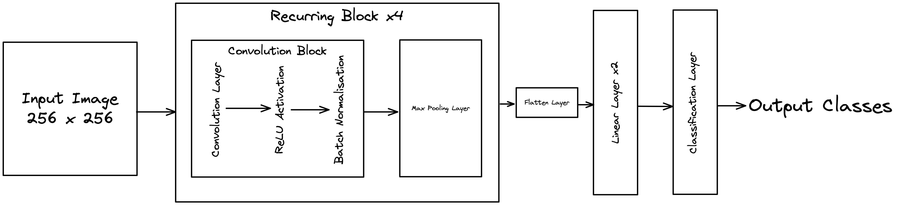

## What are hyperparameters
Hyperparameters are parameters or configuration settings that control the learning process and determine the parameters a model ends up learning. In layman's terms, hyperparameters are restraints that guide the process of model training. The prefix 'hyper' suggests that these are the top-level parameters or settings that control the training process of a model. Hyperparameters are any values in a deep learning training configuration whose value is set before the training process begins. Some of the most commonly used hyperparameters in a deep learning training process are:
- Learning Rate
- Choice of Optimization algorithm to use
- Choice of activation function in a neural network
- Choice of the loss function to train the model
- Drop-out Rate while training
- Batch size to train the model

The value of these hyperparameters plays a very important role when training any neural network, and can lead to huge changes in the final state or the final parameters of the trained model.

### Choosing hyperparameters
Optimizing the values of hyperparameters to get the best result in a certain training scenario can be a very difficult task. Existing methods include:
- Grid Search, which iterates over set values of various hyperparameters to return the best set of hyperparameters.
- Random Search, which replaces the exhaustive search method from grid search with a random selection of hyperparameters best suited for training the model.
- Bayesian Optimization, which builds a probabilistic model of function mapping. Rather than iterating over the complete search space, Bayesian optimization exploits search spaces with a high probability of having good results, which are calculated based on previous runs.

In this blog post, we shall see how to use [Optuna](https://optuna.readthedocs.io/en/stable/index.html) a hyperparameter optimization library. 

### Setting the problem statement
Before we begin with hyperparameter finetuning, we need a problem statement to tune the model on.
We shall be using the [Arthropod Taxonomy Orders Object Detection Dataset](https://www.kaggle.com/datasets/mistag/arthropod-taxonomy-orders-object-detection-dataset), but for training a simple classification network. The ground truth bounding boxes are cropped out and the images obtained are saved as images of arthropods belonging to the respective class. We will be using a simple Convolutional Neural Network to study the impact of hyperparameter optimization. The network architecture is shown in the image below.

To evaluate the performance of the model we will be using the accuracy metric. Note that an evaluation metric is necessary when performing hyperparameter optimization, this tells the optimizer (do not confuse this with network training optimizer) which set of hyperparameters gives the best result. The choice of metric may differ from problem to problem, some common problems and a good choice of evaluation metric are mentioned below:
- Classification problem: In the case of a balanced dataset with an approximately equal number of classes, accuracy can be used. For an unbalanced classification problem, the F1 Score can be used.
- Segmentation problem: IoU value can be used for a balanced dataset, for an unbalanced dataset, the F1 Score can be used.
- Generative Networks: For generative networks, the metric may vary as per the use case, for an image-to-image translation network, L1 Loss can be used to compare various hyperparameter settings.

Now that our problem statement is set, we can start with the code to initialize our training process and optimize our hyperparameters to the best values.

### Setting up the training configuration
The complete code for the blog can be found in the [Kaggle Notebook](https://www.kaggle.com/code/sheikhazhanmohammed/pytorch-tutorial-the-classification). In the blog post, we only discuss the important snippets of code that are related to hyperparameter optimization using Optuna.
The complete dataset contains 8294 images belonging to 4 different classes and each class has an approximately equal number of images, so it is a balanced dataset. For optimizing the network we shall only be using 500 random images sampled from each class to train the network, and an additional 100 images sampled per class to validate the performance of the model. This reduces the training time for each experiment. The selected images and labels are passed to the dataset class defined below:
```python
class CustomDataset(Dataset):
    def __init__(self, pathToImages, labels, transform=None):
        self.pathToImages = pathToImages
        self.labels = labels
        self.transform = transform
        
    def __len__(self):
        return len(self.pathToImages)
    
    def __getitem__(self, index):
        image = Image.open(self.pathToImages[index])
        image = image.resize((256,256))
        label = torch.tensor(self.labels[index])
        if self.transform is not None:
            image = self.transform(image)
        return image, label

trainDataset = CustomDataset(pathToTrainImages, trainImageLabels)
validationDataset = CustomDataset(pathToTestImages, testImageLabels)

trainLoader = torch.utils.data.DataLoader(trainDataset, batch_size=8)
valLoader = torch.utils.data.DataLoader(validationDataset, batch_size=4)
```
Once we have our dataset and dataloader ready we can train the model, the simple training code is mentioned below:
```python
def trainModel(model, trainLoader, optimizer, device):
    model.train()
    for (image, target) in trainLoader:
        image, target = image.to(device), target.to(device)
        optimizer.zero_grad()
        F.nll_loss(model(image), target).backward()
        optimizer.step()
```
This simple training script can easily train the model. We can now evaluate the model's accuracy on the test set, this can be done using:
```python
def evalModel(model, valLoader):
    model.eval()
    correct = 0
    with torch.no_grad():
        for (image, target) in valLoader:
            image, target = image.to(device), target.to(device)
            prediction = model(image).argmax(dim=1, keepdim=True)
            correct += pred.eq(target.view_as(pred)).sum().item()
    accuracy = correct / N_VALID_EXAMPLES
    return accuracy
```
Now that we have our train and validation function ready we can run the experiments by defining a simple experiment setup where we define the hyperparameters which we need to optimize. In this experiment we shall be optimizing the following hyperparameters:
- Choice of optimizer
- Learning rate for optimizer

The optimization loop is written below, and the explanation is provided for each of the steps as well.
```python
def objective(trial):
    device = "cuda"
    model = NeuralNetwork()
    model = model.to(device)
    optimizerName = trial.suggest_categorical("optimizer", ["Adam", "RMSprop", "SGD"])
    lr = trial.suggest_loguniform("lr", 1e-5, 1e-1)
    optimizer = getattr(optim, optimizerName)(model.parameters(), lr=lr)
    for epoch in range(10):
        trainModel(model, trainLoader, optimizer, device)
    accuracy = evalModel(model, valLoader)
    return accuracy
```
Here the variable ```optimizerName